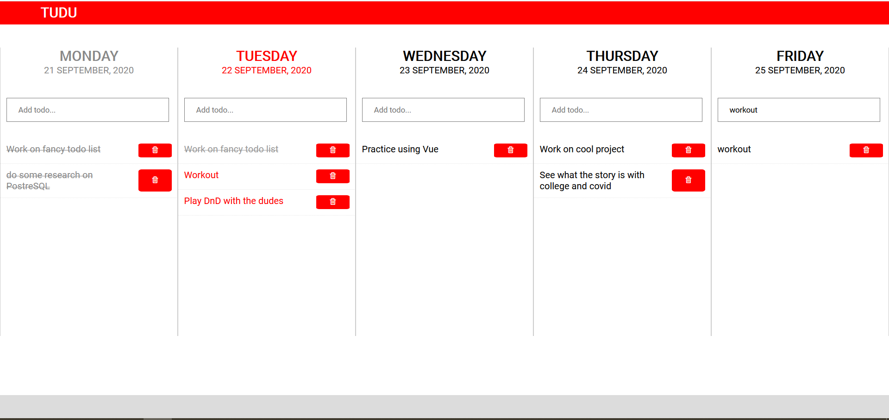

# Tududle

## Project Overview 
A functional TeuxDeux inspired todolist/organiser webapp I'm working on using Vue and Flask. 

## Current Progress
Finished the UI with the ability to add/delete/cross-out todo items done. Now working on Flask API and backend. 

